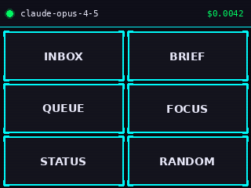

# OpenClaw Display

A dual SPI display command center for Raspberry Pi 4, designed as a physical dashboard for [OpenClaw](https://github.com/openclawai/openclaw) AI agents. Features a cyberpunk-themed UI with Molty the space lobster mascot.




## Hardware

- **Raspberry Pi 4**
- **Large display** - ILI9488 480x320 SPI TFT (main conversation view)
- **Small display** - ILI9341 320x240 SPI TFT (status/command panel with touch)
- **Touch controller** - XPT2046 (resistive, polling mode)
- **Rotary encoder** - KY-040 with push button (menu navigation)
- **LCD** - 16x2 I2C character display (status ticker)

See [CLAUDE.md](CLAUDE.md) for the full pin mapping and wiring reference.

## Installation

```bash
git clone https://github.com/lewismenelaws/openclaw-display.git
cd openclaw-display

python3 -m venv .venv
source .venv/bin/activate
pip install -r requirements.txt
```

## Configuration

Copy the example environment file and fill in your OpenClaw server details:

```bash
cp .env.example .env
```

Edit `.env` with your values:

```
OPENCLAW_URL=wss://your-server:18789
OPENCLAW_PASSWORD=your_password
OPENCLAW_AUTO_RECONNECT=true
```

## Usage

```bash
# Run the full display system (connects to OpenClaw)
python main.py

# Demo mode (no server connection required)
python main.py --demo
```

## Architecture

| Module | Description |
|--------|-------------|
| `main.py` | Entry point - coordinates displays, touch, and OpenClaw bridge |
| `display_main.py` | Large display renderer (conversation view with Molty) |
| `display_status.py` | Small display renderer (cyberpunk command panel) |
| `touch_handler.py` | XPT2046 touch input with calibration and debounce |
| `rotary_handler.py` | KY-040 rotary encoder for menu navigation |
| `lcd_ticker.py` | 16x2 I2C LCD scrolling status ticker |
| `websocket_client.py` | OpenClaw WebSocket client with Ed25519 auth |
| `openclaw_bridge.py` | Bridge between OpenClaw events and display updates |
| `openclaw_config.py` | Configuration loader (.env + defaults) |
| `config.py` | Hardware pin definitions and display settings |
| `spi_lock.py` | SPI bus mutex for shared bus access |
| `ui/` | UI components (activity feed, command panel, cyberpunk theme, Molty renderer) |

## License

[MIT](LICENSE)
